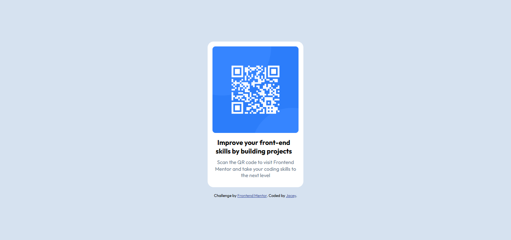

# Frontend Mentor - QR code component solution

This is my solution to the [QR code component challenge on Frontend Mentor](https://www.frontendmentor.io/challenges/qr-code-component-iux_sIO_H). Frontend Mentor challenges help you improve your coding skills by building realistic projects. 

## Table of contents

- [Overview](#overview)
  - [Screenshot](#screenshot)
  - [Links](#links)
- [My process](#my-process)
  - [Built with](#built-with)
  - [What I learned](#what-i-learned)
  - [Continued development](#continued-development)
  - [Acknowledgement]

**Note: Delete this note and update the table of contents based on what sections you keep.**

## Overview

### Screenshot

### Links
- Solution URL: [Add solution URL here](https://your-solution-url.com)
- Live Site URL: [Add live site URL here](https://your-live-site-url.com)

## My process

### Built with
- Semantic HTML5 markup
- Flexbox

### What I learned
- I learned that using semantic HTML rather than 
 is best for accessibility.
- I learned that fixed units such as pixels (px) isn't good for building responsive layouts, so I used rem and em where necessary.
- I also learned how to centre items using CSS Flexbox instead of just setting left and right-margin as auto.

### Continued development
- I would continue to explore how to create layouts that are responsive across many screens and devices. I struggle with this.
- I also would adopt mobile-first design when working on subsequent projects.

## Author
- Website - [James Chima](https://www.your-site.com)
- Frontend Mentor - [@yourusername](https://www.frontendmentor.io/profile/jacey10)
- Twitter - [@jacey_opara](https://x.com/jacey_opara)

## Acknowledgments
My sincere appreciation goes out to all members of the Frontend Mentor community who have been posting corrections to projects solutions. My project was perfect on desktop but it wasn't responsive and I didn't know what to do. Then I went through several submissions made by others and took note of the corrections given to them. Some of the corrections include,

- removing divs and using semantic HTML
- replacing fixed units (px) with rem and em
- writng media query for smaller devices
